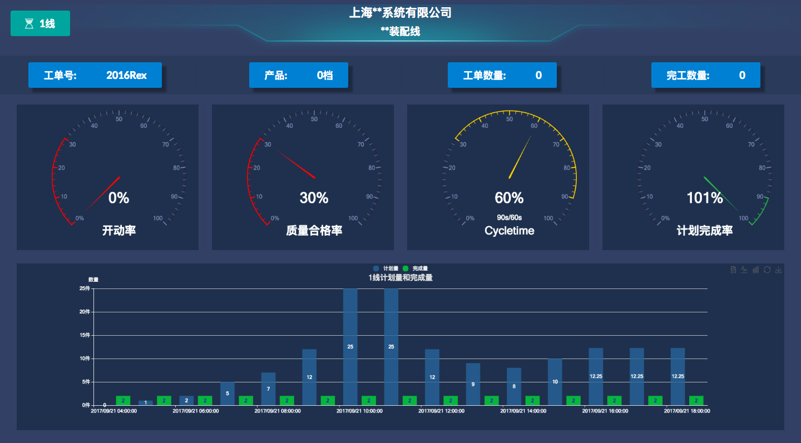

# Jy-Reporting

[](https://github.com/facebook/react)
[](https://github.com/Semantic-Org/Semantic-UI-React)
[](https://github.com/hustcc/echarts-for-react)

[](http://opensource.org/licenses/MIT)
[](http://standardjs.com)

<!-- 演示地址 <> -->
## Demo截图



## 特性

-   基于[react](https://github.com/facebook/react)，[SemanticUIReact](https://github.com/Semantic-Org/Semantic-UI-React)，[echarts-for-react](https://github.com/hustcc/echarts-for-react) 工业工厂车间看板实践。  
-   暂无响应式设计，1920*1080最佳。

## 更新日志


### 1.1

`2017-10-04`

-     更新react新版本特性，封装echarts优化。

### 1.0

`2017-10-04`

-     修复项目中components update props小bug， 优化性能
-     完成mock假数据


## 开发构建

### 目录结构

```bash
├── /build/           # 项目输出目录
├── /config/       # 打包工具配置文件
├── /scripts/       # 打包工具配置文件
├── /public/        #公共文件，编译时copy至build目录
├── /src/            # 项目源码目录
│ ├── /components/   # UI组件及UI相关方法
│ │ ├── /charts/   # 图表组件
│ │ ├── /footer/   # 脚部组件
│ │ ├── /header/  # 头部组件
│ │ ├── line1Index.js   # 测试1线组件入口
│ │ └── line2Index.js  # 测试2线组件入口
│ ├── /img/       # 图片
│ ├── /mock/       # 模拟数据文
│ ├── /utils/     # 全局工具目录
│ │ └── config.js  # 全局配置文件
│ ├── app.css       # 全局组件入口css
│ ├── app.js       # 全局组件入口js
│ ├── /utils/        # 工具函数
│ └── index.js       # 入口文件+路由配置
├── package.json     # 项目信息
```

文件夹命名说明:

-   components：组件（方法）为单位以文件夹保存，文件夹名组件首字母小写（如`header`），方法首字母小写（如`layer`）,文件夹内主文件与文件夹同名，多文件以`index.js`导出对象（如`./src/components/header`）。

### 快速开始

克隆项目文件:

```bash
git clone https://github.com/rex19/Jy-Reporting.git
```

进入目录安装依赖:

```bash
#开始前请确保没有安装roadhog、webpack到NPM全局目录
npm i 或者 yarn install
```

开发：

```bash
npm start / yarn start
打开 http://localhost:3001
```

构建：

```bash
npm run build

将会打包至build/目录 

```

## FAQ

    ```bash
      ....
    ```

